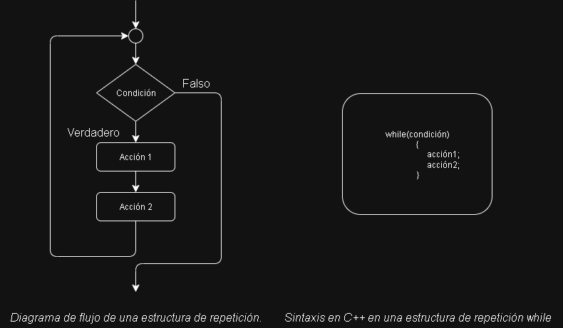
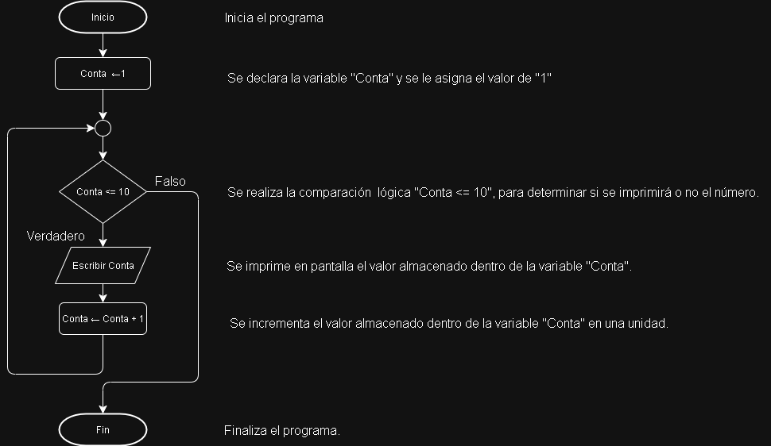
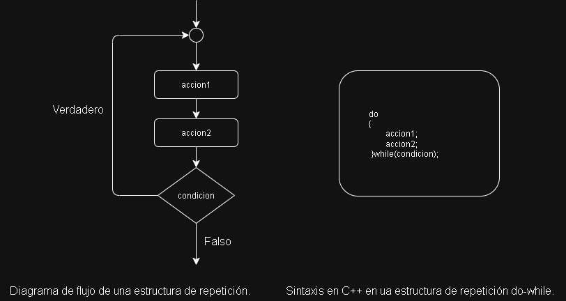
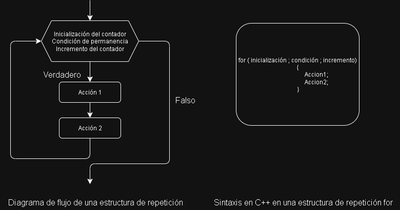
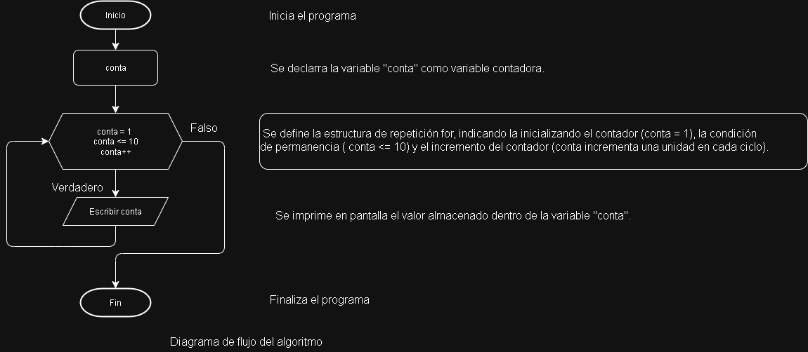

<div style="text-align:justify">

# Estructuras de repetición.

Las estructuras de repetición permiten realizar un conjunto de acciones de manera repetida *o cíclica*, siempre que el resultado de evaluar una determinada condición sea verdadero. A este tipo de estructuras también se las conoce como bucles.

Existen tres tipos de estructuras de repetición: `while`, `do-while` y `for`.

## Estructura de repetición *while* (Mientras)

En un bucle *while* primero se evalúa la condición, y en el caso de que ésta sea verdadera, se realizarán las acciones. Una vez completado el anterior ciclo, se repetirá el mismo procedimiento. Las acciones se realizarán repetidamente *mientras* el resultado de evaluar la condición sea verdadero.

A continuación, se muestra el diagrama de flujo y su sintaxis en `C++` de una estructura de repetición *while*:

<div style="text-align:center">



</div>

Para comprender como se aplica esta estrucutra a la hora de resolver problemas, a continuación, se muestra un ejemplo:

`Ejemplo`: Se desea realizar un algoritmo que imprima en pantalla los primeros diez números, utilizando una estructura de repetición *while*. Realizar el diagrama de flujo y programar en `C++` del algoritmo.

`Solución`: El algoritmo deberá, en primera instancia, declarar la variable que se va a utilizar **conta**, y asignarle el primer número. Luego, se utilizará la estructura de repetición para imprimir el número en pantalla, además de incrementar en una unidad a la variable conta (de esa forma, en el siguiente ciclo se imprimirá el siguiente número). El diagrama de flujo del algoritmo es el siguiente:

<div style="text-align:center">



*Diagrama de flujo del algoritmo.*
</div>

Una vez realizado el diagrama de flujo del algoritmo, se deberá expresar en un lenguaje de programación. El lenguaje pedido por la consigna es el `C++`.

```C++
#include<iostream>
using namespace std;
int main()
    {
        int Conta = 1; //Declara la variable entera "Conta" asignándole 1.
        while( Conta <= 10)
        {
            cout<<Conta; //Se evalúa la condición de la estructura.
            Conta = Conta + 1; //Incrementa el valor de Conta en uno.
        }
        return 0;
    }
```

## Estrucutra de repetición *do-while* (Hacer mientras).

En un bucle de *do-while* primero se realizan las acciones y después se evalúa la condición. En el caso de que ésta sea verdadera, se vuelvan a realizar las acciones. Las acciones se realizarán en forma repetida hasta que la condición sea falsa.

A continuación, se muestra el diagrama de flujo y su sintaxis en `C++` de una estructura de repetición *do-while*.

<div style="text-align: center">



</div>

Para comprender como se aplica esta estructura a la hora de resolver problemas, a continuación, se muestra un ejemplo:

`Ejemplo`: Se desea realizar un algoritmo que imprima en pantalla los primeros diez números naturales, utilizando una estructura de repetición *do-while*. Realizar el diagrama de flujo y programa en `C++` del algoritmo.

`Solución`: El algoritmo deberá, al igual que en el ejemplo anterior, declarar la variable que se va a utilizar **conta**, y asignarle el primer número. Luego, se utilizará la estructura de repetición para imprimir el número en pantalla, además de incrementar en una unidad a la variable **conta** (de esa forema, en el siguiente ciclo se imprimirá el siguiente número natural). El diagrama de flujo del algoritmo es el siguiente:

<div style="text-align: center">


</div>

Una vez realizado el diagrama de flujo del algoritmo, se deberá expresar en un lenguaje de programación. El lenguaje pedido por la consigna es `C++`:

```C++
#include<iostream>
using namespace std;
int main()
    {
        int conta = 1 // Declara la variable enterea "conta" asignándole 1.
        do
        {
            cout<< conta;   // Se imprime en pantalla el número.
            conta = conta + 1; //Incrementa el valor de conta en uno.
        }while( conta <= 10); //Se evalúa la condición de la estructura
        return 0;
    }
```

## Estructura de repetición for (Para)

En un bucle `for` las acciones se realizan un número exacto de veces. Se deben definir una variable contadora con su valor de inicio, la condición de permanencia del bucle, y el incremento de la variable contado. El `for` realizará en forma iterativa las acciones hasta que no se cumpla la condición de permanencia, y en cada iteración incrementara el valor de la variable contadora.

A continuación, se muestra el diagrama de flujo y su sintaxis en `C++` de una estructura de repetición `for`:

<div style="text-align:center">



</div>

A continuación, se muestran algunas consideraciones para tener en cuenta al utilizar estaestructura:

1. Cuando el bloque de las acciones del bucle for sólo tiene una única acción, los tokens `{` y `}` son opcionales.

2. En la inicialización del contador se especifica el valor inicial de la variable contador. Si llamamos `i` a la variable contador, ejemplos típicos de inicialización pueden ser `i=0`, `i=1`, `i=-1`, etc.

3. La condición de permanencia es la condición que se tiene que cumplir para que el for permanezca iterando dentro del bucle. Cuando esta condición no se cumpla más, el for finalizará. Ejemplos típicos de condiciones de permanencia son `i < 10`, `i <= 100`,etc.

4. El incremento de la variable contadora definirá cuánto se incrementará el contador en cada iteración. Ejemplos típicos de incrementos son `i=i+1`, `i++`, `i=i+2`, `i=i-1`, `i--`, `i=i-2`, etc.

Para comprender como se aplica esta estructura a la hora de resolver problemas, a continuación, se muestra un ejemplo:

**Ejemplo**: Se desea realizar un algoritmo que imprima en pantalla los primeros diez números naturales, utilizando una estructura de repetición for. Realizar el diagrama de flujo y programa en `C++` del algoritmo.

**Solución**: Al igual que en las soluciones anteriores, el algoritmo deberá declarar la variable que se va a utilizar (contar). Luego, se utilizará la estructura de repetición for para imprimir los números en pantalla, definiendo la inicialización del contador, la condición de permanencia y el incremento del contador. El diagrama de flujo del algoritmo es el siguiente:

<div style="text-align:center">



</div>

Una vez realizado el diagrama flujo del algoritmo, se deberá expresar en un lenguaje de programación. El lenguaje pedido por la consigna es `C++`.

```C++
#include<iostream>
using namespace std;
int main()
    {
        for( int conta = 1 ; conta <= 10 ; conta++) // Estructura repetitiva for.
        {
            cout<< conta; //Se imprime en pantalla el número.
        }
        return 0;
    }
```
<div style="text-align:center">

*Programa en `C++` del algoritmo.*

</div>

**Ejercicios**:
1. Realiza un algoritmo que cuente desde 1 hasta un número que el usuario ingrese por teclado, usando un ciclo while. Muestre cada número por pantalla. También el diagrama de flujo y el programa en `C++`.

2. Rehacer el ejercicio 1 utilizando la estructura de repetición do-while.

3. Diseñar un algoritmo basado en una estructura de repetición for que imprima en pantalla todos los números naturales comprendidos entre los valores `n` y `m`. los valores de `n` y `m` se deben ingresar por teclado. Hacer diagrama de flujo y codificación en `C++`.

4. Diseñar un algoritmo que, cuando se ingrese por teclado una contraseña numérica de cuatro dígitos correctamente, imprima en pantalla un mensaje secreto. Para la realización del algoritmo se deberá tener en cuenta los siguientes puntos:

- El programa deberá pedirle al usuario que ingrese la contraseña de cuatro dígitos.

- Si la contraseña ingresada es incorrecta, el programa deberá indicarle al usuario que la contraseña es inválida, y deberá volver a pedirle que ingrese nuevamente la contraseña.

- Si la contraseña ingresada es correcta, el programa deberá imprimir en pantalla el mensaje secreto y luego finalizar.

Hacer diagrama de flujo y codificación en C++.

5.  Realice el código que permita ingresar letras hasta que se ingrese la letra `z`. El programa debe contar la cantidad total de letras ingresadas y la cantidad de vocales.

6. Realice el código que permita ingresar setenta números enteros y determine la suma total de los mismos el número mayor ingresado y la cantidad de valores que sean mayores a diez.
</div>